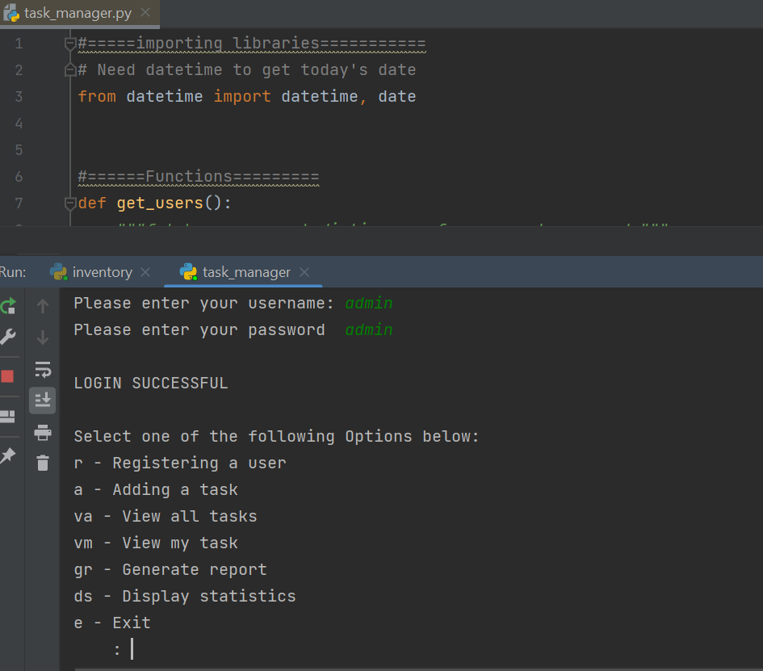

# Shoe-inventory
A Python program using a database of shoe objects to manage shoe stock

# Instalation

This project uses Python and an IDE to work.
If you do not have Python, you can download it here: https://www.python.org/downloads/
If you do not have an applicable IDE you can download a free version of PyCharm here: https://www.jetbrains.com/pycharm/download/

1. Create a folder on your PC to store the program.
2. Download all the files to a folder on your desktop.
3. Right-click on the .py file and open with PyCharm or your chosen IDE
4. Once the file has loaded in PyCharm, click the green triangle in the top right corner to run the program

# Usage

Once the program is running, follow the prompts and type in your request.

##### The options are as follows:
view - View inventory
add - Add new shoe product to inventory
search - Search shoe by product code
restock - Find shoes low in stock and restock
value - View all stock value
sale - Find shoe to mark for sale
delete - Delete a shoe from inventory

#### Note:
There are already some shoes in the inventory.
To delete them edit the .txt file and delete the shoes.

